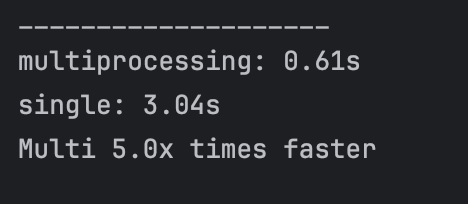
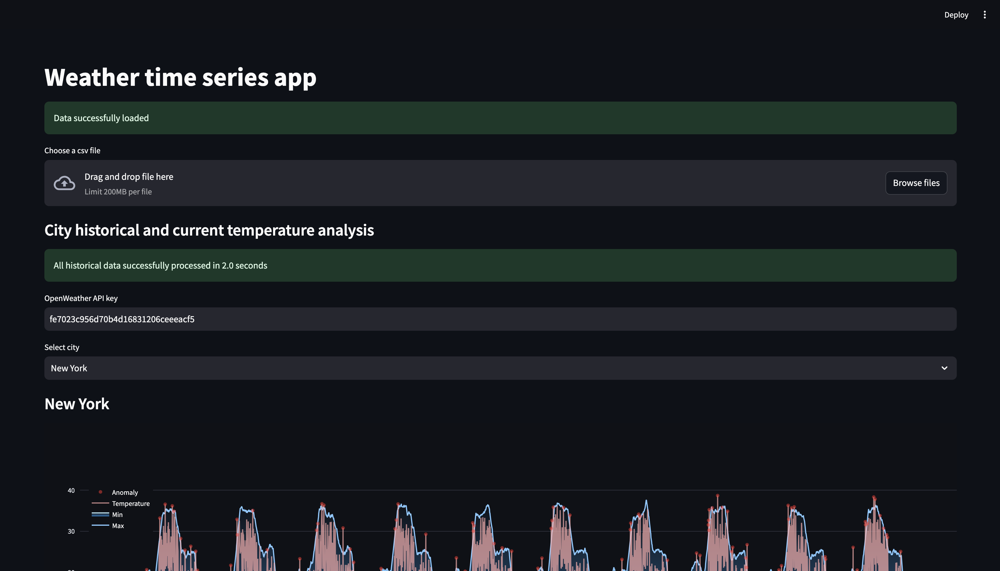
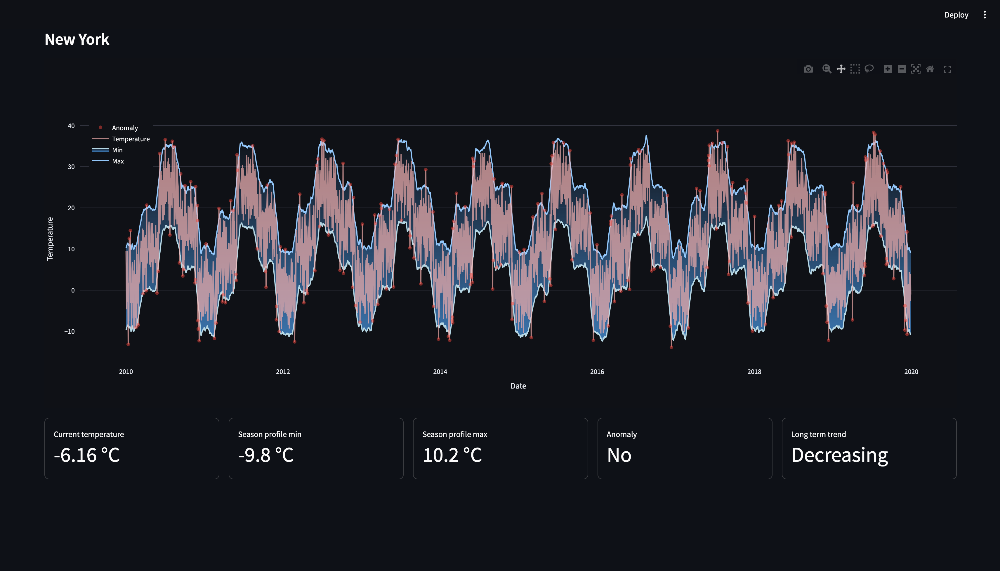

# Weather time series analysis app

### Multiprocessing

Распараллеливание проводилось с помощью Pool() из библиотеки multiprocess (multiprocessing fork).

С помощью распараллеливания процессов удалось достичь ускорения в 5х раз по сравнению с последовательным однопроцессным циклом на Apple M1. Среднее время ожидания менее 1 секунды.

В Google Colab распараллеливание не дало результатов, поскольку работа ограничена одним процессом.

В Streamlit удалось достичь ускорения в 1.5-2х раз, поскольку, судя по всему, там выделяется максимум 2 процесса. Но отрабатывают функции долго все равно, иногда даже могут и вовсе не отработать. Среднее время ожидания от 3 минут. Функции усложнялись умышлено, чтобы оценить результаты распараллеливания.

### Async requests

Запросы выполняются асинхронно, поскольку мы делаем сразу много запросов по нескольким городам.

